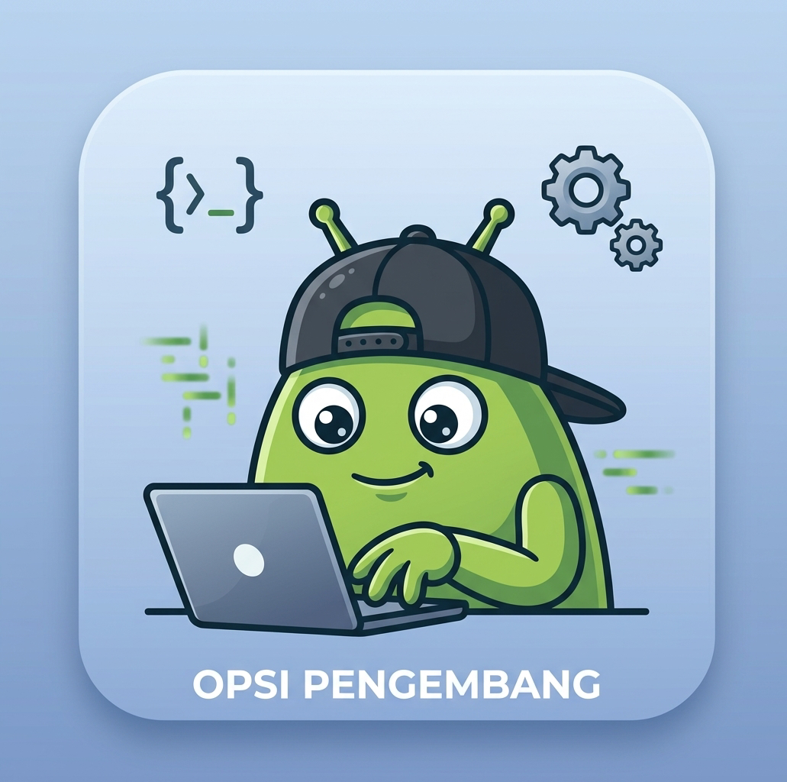

  

# Opsi Pengembang

Aplikasi Android ringan tanpa tampilan (non-UI) yang berfungsi sebagai **jembatan pintar** menuju halaman **Build Number** di pengaturan HP, supaya pengguna tinggal mengetuk **7 kali** untuk mengaktifkan **Opsi Pengembang** - tanpa harus bingung mencari sendiri.

## Fitur

- **Non-UI** - ikon diklik, langsung bekerja. Tidak ada layar yang mengganggu.
- **Cerdas & adaptif** - mendeteksi merek/ROM HP dan mengarahkan ke halaman Build Number yang tepat.
- **Multi-merek & multi-bahasa** - mendukung 90+ variasi istilah Build Number (Indonesia, Inggris, Mandarin, Jepang, Korea, Arab, Hindi, dll).
- **Auto submenu** - otomatis menap submenu seperti Versi (ColorOS), Semua Spesifikasi (MIUI), Informasi Perangkat Lunak (One UI), jika Build Number berada di dalamnya.
- **Auto tap 7x** - menggunakan Accessibility Service untuk mengetuk Build Number 7 kali secara otomatis.

## Tentang Opsi Pengembang

**Opsi Pengembang (Developer Options)** adalah menu tersembunyi di Android yang ditujukan untuk pengembang aplikasi, teknisi, dan pengguna tingkat lanjut. Menu ini disembunyikan secara default agar tidak sembarangan diubah oleh pengguna awam, karena berisi pengaturan teknis yang bisa mempengaruhi performa dan stabilitas sistem.

### Mulai Android Berapa?

Menu Developer Options sudah ada sejak era awal Android, namun **disembunyikan di balik tap 7x Build Number sejak Android 4.2 (Jelly Bean, 2012)**. Sejak saat itu, setiap versi Android (4.2 hingga 14) menggunakan cara yang sama: buka Tentang Ponsel, lalu tap Build Number 7 kali.

### Kelebihan & Fungsi Opsi Pengembang

- **USB Debugging** - menghubungkan HP ke komputer via ADB (untuk flashing, root, development, backup, dsb).
- **Wireless Debugging** - ADB tanpa kabel (Android 11+).
- **Mock Location** - mensimulasikan lokasi GPS palsu (untuk pengujian aplikasi).
- **Animation Scale** - mempercepat / memperlambat animasi sistem.
- **Force GPU Rendering** - memaksa rendering 2D lewat GPU, bisa meningkatkan performa game ringan.
- **Background Process Limit** - membatasi jumlah proses latar belakang (hemat RAM/baterai).
- **Show Taps / Pointer Location** - menampilkan sentuhan jari di layar (untuk demo/tutorial).
- **Don't Keep Activities** - menghancurkan activity saat ditinggalkan (untuk uji coba developer).
- **OEM Unlocking** - membuka bootloader (untuk install custom ROM / recovery).
- **Bug Report / Logger** - mengambil log sistem untuk diagnosa masalah.
- **Dan puluhan fitur teknis lainnya** - tergantung versi Android dan merek HP.

## Kompatibilitas

| Item | Keterangan |
|------|------------|
| Minimum Android | 4.2 (Jelly Bean, API 17) |
| Target Android | 14 (API 34) |
| Arsitektur | Universal (semua) |

**Mendukung otomatis sebagian besar HP Android:**
Samsung One UI, Xiaomi MIUI/HyperOS, Oppo/Realme ColorOS, Vivo FuntouchOS, Huawei/Honor EMUI, OnePlus OxygenOS, Google Pixel, Nokia, Sony, Asus ZenUI, dan lainnya.

Beberapa HP dengan proteksi khusus (Xiaomi HyperOS terbaru, Samsung Knox enterprise) mungkin tidak mendukung mode otomatis. Kalau gagal, silakan laporkan dengan screenshot halaman Tentang Ponsel agar istilahnya bisa ditambahkan di versi berikutnya.

## Cara Pakai

1. Install APK dari halaman Releases.
2. Klik ikon Opsi Pengembang.
3. Saat pertama kali, kamu akan diarahkan ke halaman Aksesibilitas - aktifkan "Opsi Pengembang Otomatis".
4. Klik ikon sekali lagi, aplikasi akan otomatis:
   - Membuka Tentang Ponsel
   - Masuk ke submenu yang benar (jika perlu)
   - Mengetuk Build Number 7x
5. Selesai! Buka Settings - Sistem - Opsi Pengembang.

## Kontribusi

Kalau aplikasi ini gagal di HP kamu, buka Issue dengan menyertakan:
- Merek + tipe HP
- Versi Android
- Screenshot halaman Tentang Ponsel

Kontribusi keyword baru sangat diterima demi cakupan yang lebih luas.
